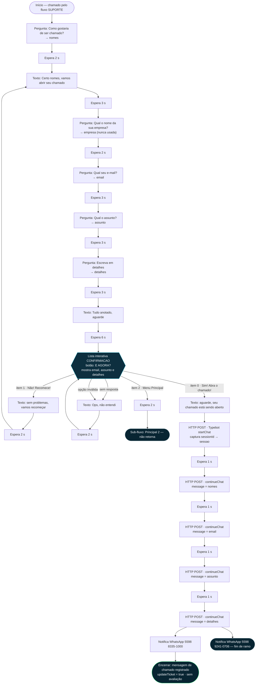

# 🎫 25 — O FLUXO "ABERTURA DE CHAMADO" DA RAGNATELA
### Engenharia reversa nó a nó, somente leitura, e a especificação para reconstruí-lo no Ragnabot

> **Data da medição:** 28/08/2026, entre 13h28 e 13h50 (UTC−3).
> **Alvo:** VM **10016 — RGTSRVCHAT001** (hipervisor RGTSRVHST001), banco PostgreSQL do
> ConnectAi/Whaticket 8.1.1.
> **Método:** consultas `SELECT` executadas dentro da própria VM. **Nenhuma escrita**, nenhum
> arquivo criado na máquina, nenhum reinício, nenhuma credencial extraída.
> **Documentos irmãos:** `18-LEVANTAMENTO-CHAT-ATUAL.md` (o levantamento que deu origem a este) e
> `19-COMPARATIVO-E-BACKLOG-RAGNABOT.md` (§3, item **B1**, com o catálogo mínimo de nós).

---

## 0. Sumário — o que este fluxo é, em oito linhas

O **ABERTURA DE CHAMADO** é o robô que a Ragnatela usa para registrar um chamado de suporte sem
ocupar um analista. Ele faz **cinco perguntas** (nome, empresa, e-mail, assunto, detalhes), mostra
um **resumo para o cliente confirmar** numa lista interativa de três opções, e — se confirmado —
**despeja as respostas numa sessão do Typebot na nuvem**, avisa **dois celulares internos** por
WhatsApp, manda a mensagem de "chamado registrado" e **encerra a conversa**.

Não encaminha para setor nenhum. Não aplica etiqueta nenhuma. Não pede avaliação. Não guarda o
chamado em tabela alguma deste sistema — o registro efetivo acontece **fora**, dentro do Typebot,
que este levantamento **não conseguiu ler**.

---

## 1. Como a medição foi feita (para poder ser refeita)

1. **Caminho:** `sshProxmoxExec` do NOC até RGTSRVHST001 e, de lá,
   `qm guest exec 10016 -- /bin/bash -c "echo <script em base64> | base64 -d | bash"`.
   O script inteiro foi codificado em base64 justamente porque shell aninhado corrompe `$` e aspas.
2. **Banco:** as credenciais foram lidas **dentro da VM**
   (`/home/deployautomatizaai/whaticket/backend/.env`) e usadas ali mesmo pelo `psql`.
   Nenhuma delas saiu da máquina nem foi gravada em lugar nenhum.
3. **Saída:** cada consulta devolveu o resultado em base64, decodificado só do lado do NOC, para
   não perder acentuação no caminho.
4. **Uma execução de cada vez.** O `qm guest exec` tem tempo limite que **não mata** o processo no
   convidado; duas chamadas simultâneas colidem.

**Tenant confirmado antes de qualquer leitura de fluxo:**

| id | empresa |
|---:|---|
| **1** | **Ragnatela** ← o alvo |
| 2 | Multiplique Soluções Empresariais |
| 4 | GF Imoveis |
| 5 | Monopolio |
| 6 | Unopar Barrerinhas |
| 7 | Ela Faz |
| 8 | Analise Consultoria e Assessoria |
| 9 | Instituto Juscelino Kubistchet Consursos |
| 10 | Duailibe |
| 11 | Multiplique |

---

## 2. Onde o fluxo vive e como se chega até ele

### 2.1 Identificação

| campo | valor medido |
|---|---|
| Tabela | `Flows` |
| `id` | `9ec41043-88ca-493b-95d4-66526c43e23d` |
| `name` | **ABERTURA DE CHAMADO** |
| `companyId` | **1** (Ragnatela) |
| `createdAt` | 28/06/2025 16:00:50 (UTC−3) |
| `updatedAt` | 28/08/2026 13:25:09 (UTC−3) — quatro minutos antes da primeira consulta |
| Nós | **35** |
| Arestas | **37** |
| `keywords` | `[{"keyword":"","matchType":"igual","caseSensitive":false}]` — **vazio: nenhuma palavra dispara este fluxo** |
| `schedule` | os sete dias com `active:false` — **horário próprio desligado** (a empresa 1 usa `scheduleType=company`) |
| `offHoursMessage` | `""` (vazio) · `closeAfterOffHoursMessage` = `false` |
| `flowVariables` | `{}` — **nenhuma variável declarada**; todas nascem dos nós de pergunta |
| `useMenuLimit` | `true` · `quantidadeEnvios` = 1 · `isTestMode` = `false` · `testNumber` = nulo |

> **Sobre o `updatedAt` de hoje:** eu não escrevi nada. A explicação mais provável — e é
> **inferência** — é que o produto grava a telemetria **dentro do próprio documento do fluxo**
> (os campos `envios`, `cliques` e `CTR` vivem no JSON dos nós, §7), de modo que **toda interação
> de cliente reescreve a linha inteira da tabela `Flows`**. Os fluxos vizinhos `SETOR SUPORTE` e
> `Principal NORMAL` também aparecem com `updatedAt` no mesmo minuto. É um detalhe de arquitetura
> que o Ragnabot **não** deve repetir (§12.2).

### 2.2 A cadeia de entrada — este fluxo nunca é o primeiro

As duas conexões de WhatsApp da Ragnatela (`Whatsapps` id 42 "RAGNATELA" e id 45 "Suporte
Ragnatela", ambas `CONNECTED`, ambas `channel = whatsmeow`) apontam `flowId` **e**
`firstContactFlowId` para o fluxo **`Principal NORMAL`**. Daí em diante é sub-fluxo chamando
sub-fluxo:

```
Conexão 42 / 45  (maxUseBotQueues 9999 · expiresTicket 1)
   └── Principal NORMAL   (e8dc59e7…)   lista "OPÇÕES", 5 itens
         └── opção 1 "Suporte"  (CTR 960 de 1.271 cliques)
               └── SUPORTE      (f2ff4b8e…)   botões, 3 opções
                     ├── botão 0 "Abrir Chamado!"      (CTR 583)  → notifica 2 números → espera 3 s
                     │     └── ★ ABERTURA DE CHAMADO   (9ec41043…)   ← ESTE DOCUMENTO
                     ├── botão 1 "Analista de Suporte" (CTR 168)  → notifica 2 números → SETOR SUPORTE
                     └── botão 2 "Menu Principal 🏠"   (CTR 20)   → Principal 2
```

**Consequência que importa para a portabilidade:** o fluxo nasce **já com contexto**. Quando ele
começa, o cliente já leu a saudação, já escolheu "Suporte" e já escolheu "Abrir Chamado". As
variáveis `{{{nomes}}}`, `{{{empresa}}}`, `{{{email}}}`, `{{{assunto}}}` e `{{{detalhes}}}`,
porém, **não vêm de fora** — todas são criadas dentro dele.

### 2.3 O gêmeo idêntico

Existe um segundo fluxo, **`Sub_Suporte_Abertura`** (`831e1563…`), com os **mesmos 35 nós, os
mesmos títulos e as mesmas chamadas HTTP**. Ele pertence a uma árvore paralela
(`Router_Principal` → `Sub_Suporte` → `Sub_Suporte_Abertura`) que **nenhuma conexão aponta hoje**.
Os contadores dele (447 envios / 313 cliques na lista de confirmação) mostram que já esteve no ar.
**Ao migrar, é um fluxo só, não dois** — mas alguém precisa decidir qual árvore sobrevive.

---

## 3. O fluxo nó a nó

Ordem de execução real, seguindo as arestas. Os textos estão **exatamente** como estão no banco,
inclusive os erros de digitação e os acentos faltando. `{{{variável}}}` (três chaves) é variável do
fluxo; `{{variável}}` (duas chaves) é variável do sistema.

| # | id curto | tipo | título interno | o que faz / texto exato | variável | saídas |
|---:|---|---|---|---|---|---|
| 1 | `853a45c5` | `saudationNode` | *(sem título)* | Ponto de entrada. `content` e `heading` **vazios** — não fala nada | — | única → 2 |
| 2 | `c44b0d8f` | `perguntaNode` | QUAL SEU NOME | «Vamos lá! Como gostaria de ser chamado?» | **`nomes`** | única → 3 |
| 3 | `1a8355bf` | `waitNode` | Espera | pausa **2 segundos** | — | única → 4 |
| 4 | `647d483f` | `customNode` | MENSAGEM DE INICIO | «Certo \*{{{nomes}}}\* , vamos abrir seu chamado tudo bem? Por favor responda as seguintes perguntas!» | — | única → 5 |
| 5 | `1a3384ee` | `waitNode` | Espera | pausa **3 segundos** | — | única → 6 |
| 6 | `236c861d` | `perguntaNode` | EMPRESA | «Qual o nome da sua \*empresa\* ?» | **`empresa`** ⚠️ nunca usada | única → 7 |
| 7 | `db9bd384` | `waitNode` | Espera | pausa **2 segundos** | — | única → 8 |
| 8 | `1715886c` | `perguntaNode` | QUAL SEU EMAIL | «Qual seu \*email\*?» | **`email`** (sem validação) | única → 9 |
| 9 | `dccdf6f1` | `waitNode` | Espera | pausa **3 segundos** | — | única → 10 |
| 10 | `662207a4` | `perguntaNode` | ASSUNTO | «Certo, qual o \*assunto\* que deseja tratar? Descreva em linha curta. Apenas o tema!» | **`assunto`** | única → 11 |
| 11 | `a40211f5` | `waitNode` | Espera | pausa **3 segundos** | — | única → 12 |
| 12 | `b022270e` | `perguntaNode` | DETALHES | «Perfeito, para encerrar, \*escreva em detalhes\* sua solicitacao! » | **`detalhes`** | única → 13 |
| 13 | `42ecc638` | `waitNode` | Espera | pausa **3 segundos** | — | única → 14 |
| 14 | `f18797a3` | `customNode` | MONTAR CHAMADO | «Ótimo \*{{{nomes}}}\*, tudo anotado! Por favor, aguarde enquanto eu registro seu chamado. Em breve eu confirmo a abertura para você!» | — | única → 15 |
| 15 | `b5603fcf` | `waitNode` | Espera | pausa **6 segundos** | — | única → 16 |
| **16** | `7aef418b` | **`menuListaNode`** | **CONFIRMACAO** | Lista interativa do WhatsApp. Botão da lista: **«E AGORA? 🫡»**. Corpo: «\*{{{nomes}}}\*, poderia me \*confirmar\* se está tudo correto?⏎⏎Email: \*{{{email}}}\*⏎⏎Assunto: \*{{{assunto}}}\*⏎⏎Descrição: \*{{{detalhes}}}\*». `responseTimeout` = **4** *(sem unidade declarada)* | — | **quatro saídas** ↓ |
| | | | ↳ item 0 | **«Sim! Abra o chamado! ✅ »** — «Iremos abrir um chamado agora mesmo!» | | → 17 |
| | | | ↳ item 1 | **«Não! Recomece! 🔄»** — «Sem problemas. Iremos repetir os passos da abertura de chamado» | | → 30 |
| | | | ↳ item 2 | **«Menu Principal 🏠 »** — «Levaremos você novamente ao nosso menu principal.» | | → 33 |
| | | | ↳ `no-response` e `invalid-option` | ambas caem no mesmo lugar | | → 32 |
| 17 | `35083c9a` | `customNode` | CONFIRMACAO DE ABERTURA | «Maravilha \*{{{nomes}}}\*, por favor aguarde que seu chamado está sendo aberto! 😀» | — | única → 18 |
| 18 | `68fb9000` | `httpRequestNode` | **TYPEBOT-START** | `POST` abrindo sessão no Typebot (§6) | grava **`sessao`** | única → 19 |
| 19 | `3d18bbd2` | `waitNode` | Espera | pausa **1 segundo** | — | única → 20 |
| 20 | `89a618a6` | `httpRequestNode` | TYPEBOT-ENVIO1 | `POST` na sessão com `{"message": "{{{nomes}}}"}` | — | única → 21 |
| 21 | `ec9addb4` | `waitNode` | Espera | pausa **1 segundo** | — | única → 22 |
| 22 | `f4da937f` | `httpRequestNode` | TYPEBOT-ENVIO2 | `POST` com `{"message": "{{{email}}}"}` | — | única → 23 |
| 23 | `3896e943` | `waitNode` | Espera | pausa **1 segundo** | — | única → 24 |
| 24 | `b6c0315c` | `httpRequestNode` | TYPEBOT-ENVIO3 | `POST` com `{"message": "{{{assunto}}}"}` | — | única → 25 |
| 25 | `dd41c4ed` | `waitNode` | Espera | pausa **1 segundo** | — | única → 26 |
| 26 | `340566c9` | `httpRequestNode` | TYPEBOT-ENVIO4 | `POST` com `{"message": "{{{detalhes}}}"}` | — | ⚠️ **duas arestas na mesma saída** → 27 **e** → 28 |
| 27 | `e776539f` | `notyNode` | NOTIFICA CHAMADO | Manda WhatsApp para **`559883351000 `** *(com espaço no fim)* — o número do Emmanuel. Texto: «\*RAGNATELA BOT INFORMA\*:⏎⏎Chamado aberto abaixo informacoes dessa \*solcitacão\*:⏎⏎Solicitante: \*{{name}}\*⏎⏎Email: \*{{{email}}}\*⏎⏎Assunto: \*{{{assunto}}}\*⏎⏎Descrição: \*{{{detalhes}}}\*» | — | única → 29 |
| 28 | `3bdeeb00` | `notyNode` | Notificação Fernando | **mesmo texto**, para **`559892410706`** (Fernando, usuário 76) | — | **nenhuma saída** (fim de ramo) |
| 29 | `aea2f982` | `ticketNode` | **ENCERRAMENTO** | Envia a mensagem de fechamento (640 caracteres, transcrita em §5.1) e marca `updateTicket: true`. **Sem `sendRating`** | — | **nenhuma saída** (fim do fluxo) |
| 30 | `9ce15dca` | `customNode` | SEM PROBLEMAS | «{{{nomes}}}, sem problemas, vamos recomeçar agora mesmo. 🫡» | — | única → 31 |
| 31 | `ebf1db85` | `waitNode` | Espera | pausa **2 segundos** | — | única → **4** (volta à MENSAGEM DE INICIO — refaz as cinco perguntas) |
| 32 | `795d61e2` | `customNode` | NAO ENTENDI | «Ops, não entendi! 🤯. Pode tentar novamente? 😉» | — | única → 34 |
| 33 | `4e607e08` | `waitNode` | Espera | pausa **2 segundos** | — | única → 35 |
| 34 | `12f427df` | `waitNode` | Espera | pausa **2 segundos** | — | única → **16** (reapresenta a lista de confirmação) |
| 35 | `623a0d8b` | `fluxoNode` | FLUXO PRINCIAPL | Salta para o fluxo **`Principal 2`** (`6b85fdc9…`) | — | **nenhuma saída** (entrega o controle e não volta) |

### 3.1 As variáveis, uma a uma

| variável | criada em | usada em | destino final |
|---|---|---|---|
| `nomes` | pergunta 2 | mensagens 4, 14, 16, 17, 29, 30 e no `TYPEBOT-ENVIO1` | Typebot |
| **`empresa`** | pergunta 6 | **em lugar nenhum** | ⚠️ **descartada** |
| `email` | pergunta 8 | resumo 16, notificações 27/28, `TYPEBOT-ENVIO2` | Typebot + WhatsApp interno |
| `assunto` | pergunta 10 | resumo 16, notificações 27/28, `TYPEBOT-ENVIO3` | Typebot + WhatsApp interno |
| `detalhes` | pergunta 12 | resumo 16, notificações 27/28, `TYPEBOT-ENVIO4` | Typebot + WhatsApp interno |
| `sessao` | resposta do `TYPEBOT-START` (`response.data.sessionId`) | na URL dos quatro envios seguintes | interno |
| `{{name}}` | variável **de sistema** (nome do contato) | notificações 27 e 28 | WhatsApp interno |

> **A pergunta da empresa é feita, respondida e jogada fora.** Confirmado por busca em todos os 35
> fluxos do banco: a expressão `{{{empresa}}}` **não aparece em nenhum**. O cliente responde para
> nada, e mais um passo de atrito é cobrado dele sem contrapartida.

---

## 4. O diagrama



**Tempo de espera embutido:** 2 + 3 + 2 + 3 + 3 + 3 + 6 = **22 segundos** de pausa antes da
confirmação, mais **4 segundos** distribuídos entre as chamadas ao Typebot. Isso é apenas o que o
robô impõe; não conta o tempo que o cliente leva para responder as cinco perguntas.

---

## 5. O que ele faz no fim

### 5.1 A mensagem de encerramento (nó `ticketNode`, texto integral)

> Obrigado por aguardar \*{{{nomes}}}\* ! 🤝
>
> Temos uma \*ótima notícia\*: seu chamado foi registrado com sucesso! ✅
>
> Fique tranquilo(a)! Estamos trabalhando para resolver sua solicitação o mais rápido possível. Em
> breve, você receberá todas as informações e atualizações diretamente no \*e-mail\* que você nos
> informou. 📧
>
> Para a sua comodidade e para otimizar nossos processos, este atendimento via WhatsApp será
> \*encerrado agora\*. O acompanhamento e todas as novidades sobre seu chamado seguirão pelo seu
> e-mail ou nossos analistas entraram em contato em caso de necessidade.
>
> Agradecemos a sua compreensão e confiança. \*Estamos à disposição\*! 😊🤝

### 5.2 O que acontece de fato, item por item

| pergunta | resposta medida |
|---|---|
| **Abre chamado onde?** | **Fora deste sistema.** Não há tabela de chamados aqui. O único destino é a **sessão do Typebot** (§6). O que o Typebot faz com os quatro campos — se grava, se envia e-mail, se abre em algum helpdesk — **não foi possível determinar** (§13) |
| **Notifica quem?** | **Dois celulares fixos, escritos no próprio nó:** `559883351000 ` (com espaço sobrando no fim — Emmanuel) e `559892410706` (Fernando). Não é "notificar o responsável"; é número cravado no fluxo |
| **Aplica etiqueta?** | **Não.** O fluxo não tem nenhum `tagNode` |
| **Encaminha para qual setor?** | **Nenhum.** O fluxo não tem `filaNode`. O atendimento é **encerrado sem setor**. Os quatro setores da empresa 1 são Suporte (1), Comercial (2), Outros (3) e AGUARDANDO (5) — nenhum deles é tocado por este fluxo |
| **Pede avaliação?** | **Não.** O `ticketNode` traz apenas `updateTicket: true`; o campo `sendRating` sequer existe neste nó. Coerente com a configuração da empresa: `userRating = disabled` |
| **Pede motivo de encerramento?** | **Não.** `requireTicketCloseReason = disabled` na empresa 1 |
| **O que sobra no banco depois?** | A conversa fechada com as mensagens trocadas. `Tickets.flowId` está **nulo em todos os 439 tickets** da empresa 1 — ou seja, **não fica registrado por qual fluxo o cliente passou** |

---

## 6. A chamada externa — o que sai da nossa rede

**Um único sistema externo: o Typebot na nuvem pública (`typebot.io`).** São cinco chamadas HTTP
em sequência, todas com os mesmos dois cabeçalhos: `Content-Type: application/json` e um
`Authorization: Bearer <token>` — **o token existe, está gravado em texto claro dentro do JSON do
fluxo, e não é reproduzido aqui**.

| passo | método | destino | corpo enviado | o que captura |
|---|---|---|---|---|
| `TYPEBOT-START` | `POST` | `…/api/v1/typebots/<identificador-do-bot>/startChat` | vazio | `response.data.sessionId` → variável `sessao` |
| `TYPEBOT-ENVIO1` | `POST` | `…/api/v1/sessions/{{{sessao}}}/continueChat` | `{"message": "<nome>"}` | nada |
| `TYPEBOT-ENVIO2` | `POST` | idem | `{"message": "<e-mail>"}` | nada |
| `TYPEBOT-ENVIO3` | `POST` | idem | `{"message": "<assunto>"}` | nada |
| `TYPEBOT-ENVIO4` | `POST` | idem | `{"message": "<detalhes>"}` | nada |

**Leitura honesta do desenho:** isto **não é uma integração**, é uma **digitação automatizada**. O
fluxo abre uma conversa com um segundo robô e "digita" quatro mensagens nele, uma por vez, com um
segundo de pausa entre elas — exatamente como um humano faria. Consequências medidas ou evidentes:

- **Nenhum dos quatro envios lê a resposta.** O campo `responses` está vazio nos quatro. Se o
  Typebot recusar, expirar a sessão ou mudar a ordem das perguntas, **o fluxo segue adiante e
  avisa o cliente que o chamado foi registrado do mesmo jeito**.
- **Não existe tratamento de erro.** Nenhum nó tem saída de falha. Se o `startChat` não responder,
  `{{{sessao}}}` fica vazia, as quatro chamadas seguintes vão para uma URL inválida, e a
  mensagem de sucesso é enviada assim mesmo.
- **A ordem é posicional.** Nome, e-mail, assunto e detalhes chegam ao Typebot **pela sequência**,
  não por nome de campo. Mexer no Typebot sem mexer aqui troca os dados de lugar em silêncio.
- **O `empresa` não é enviado** — mais uma confirmação de que a pergunta é atrito puro.
- **Dependência de nuvem de terceiro** para o registro do chamado, com token no documento do fluxo.

---

## 7. Sinais de uso — o fluxo é vivo?

### 7.1 Telemetria gravada dentro do próprio nó

O produto guarda contadores dentro do JSON dos nós interativos. Do nó **CONFIRMACAO**:

| medida | valor |
|---|---:|
| `envios` (vezes que a lista foi apresentada) | **518** |
| `cliques` (vezes que alguém escolheu algo) | **367** |
| item 0 — «Sim! Abra o chamado! ✅ » | **358** |
| item 1 — «Não! Recomece! 🔄» | **5** |
| item 2 — «Menu Principal 🏠 » | **4** |

**Taxa de conclusão da confirmação: 367 de 518 = 70,8 %.** Dos que responderam, **97,5 % (358)
confirmaram**. A tela de confirmação, portanto, quase nunca corrige nada — mas **151 pessoas
chegaram até o resumo e não responderam**.

Comparando com a porta de entrada: o botão «Abrir Chamado!» no fluxo `SUPORTE` acumula **583**
cliques, e a lista de confirmação foi apresentada **518** vezes. A diferença de **65** é a
desistência **durante as cinco perguntas**.

### 7.2 O que aparece na tabela de mensagens

| medida | valor |
|---|---|
| Mensagens «seu chamado foi registrado com sucesso» | **309**, de 30/06/2025 a **28/08/2026 09h22** |
| Notificações «RAGNATELA BOT INFORMA … Chamado aberto» | **196** |
| Mensagens da lista de confirmação com o corpo gravado | **171**, todas entre 30/06/2025 e **16/01/2026** |

Por mês, as mensagens de "chamado registrado":

```
2025-06  1 │ 2025-07 17 │ 2025-08 32 │ 2025-09 24 │ 2025-10 13 │ 2025-11 11
2025-12  3 │ 2026-01  2 │ 2026-02  9 │ 2026-03 23 │ 2026-04 30 │ 2026-05 51
2026-06 30 │ 2026-07 30 │ 2026-08 33
```

**O fluxo está vivo e em uso corrente** — 33 chamados fechados só em agosto de 2026, o mais
recente na manhã da medição.

⚠️ **Três ressalvas de honestidade sobre esses números.**
1. O texto de encerramento é **idêntico** no fluxo gêmeo `Sub_Suporte_Abertura`. Os 309 são a soma
   dos dois; não dá para separar por busca de texto.
2. As 171 confirmações com corpo gravado param em janeiro de 2026, embora mensagens do tipo
   `listMessage` continuem sendo gravadas (198 só em agosto de 2026). **Inferência:** em algum
   ponto o produto deixou de persistir o corpo das listas. O contador do nó (518) é a medida
   disponível, e ele é maior que o que a tabela mostra.
3. 309 encerramentos contra 196 notificações internas é uma diferença de **113**. Não foi possível
   determinar a causa dentro do prazo desta leitura: pode ser envio recusado pelo canal, pode ser
   o mesmo problema de persistência do item anterior.

---

## 8. Os defeitos que a leitura encontrou

Nenhum destes foi corrigido — a tarefa é somente leitura. Ficam registrados porque **reproduzir o
fluxo com os defeitos dentro seria migrar o erro junto**.

| # | defeito | evidência | efeito |
|---:|---|---|---|
| D1 | **A empresa é perguntada e descartada** | `{{{empresa}}}` não aparece em nenhum dos 35 fluxos | Um passo de atrito sem contrapartida, em cada abertura |
| D2 | **Nenhuma validação de e-mail** | `perguntaNode` só tem `content`, `heading` e `response` | O chamado inteiro depende de um e-mail que ninguém conferiu, e a mensagem final promete resposta por ele |
| D3 | **Mensagem de sucesso sem prova de sucesso** | os cinco nós HTTP têm `responses` vazio e não há saída de erro | O cliente pode receber "registrado com sucesso" com o registro tendo falhado |
| D4 | **Número de notificação cravado no nó, com espaço no fim** | `"notifyNumber": "559883351000 "` | Trocar de plantonista exige editar o fluxo; o espaço é uma bomba-relógio para qualquer canal mais estrito |
| D5 | **Duas arestas saindo da mesma saída** | `TYPEBOT-ENVIO4` → `NOTIFICA CHAMADO` **e** → `Notificação Fernando`, ambas em `h-out-default` | Comportamento indefinido pelo desenho; o encerramento só está pendurado num dos dois ramos |
| D6 | **Ramo morto de encerramento** | `Notificação Fernando` não tem saída | Se o motor escolher esse ramo, o cliente nunca recebe a mensagem final |
| D7 | **`responseTimeout: 4` sem unidade** | o mesmo campo em `Principal NORMAL` traz `responseUnit: "minutos"`; aqui o campo não existe | Não dá para afirmar se a lista espera 4 segundos ou 4 minutos |
| D8 | **Encerra sem setor, sem etiqueta e sem tabulação** | ausência de `filaNode` e `tagNode`; `requireTicketCloseReason = disabled` | Não há como medir depois quantos chamados vieram por bot, de que assunto, com que resultado |
| D9 | **Segredo no documento do fluxo** | o `Bearer` do Typebot está em texto claro no JSON de `Flows`, replicado em 10 nós | Quem exporta o fluxo exporta a credencial |
| D10 | **Telemetria dentro do documento** | `envios`, `cliques` e `CTR` moram no JSON dos nós | Toda interação reescreve a linha inteira de `Flows` (inferência, §2.1) |
| D11 | **Fluxo duplicado** | `Sub_Suporte_Abertura` é cópia byte a byte | Duas verdades para a mesma conversa |
| D12 | **`Tickets.flowId` nulo em 100 % dos casos** | 439 tickets da empresa 1, todos com `flowId` nulo | Impossível responder "por qual fluxo esse cliente passou?" |

---

## 9. Portabilidade para o Ragnabot — nó a nó contra o catálogo B1

O catálogo mínimo decidido no documento 19, §3, item **B1** é: *início · mensagem de texto · mídia ·
pergunta com variável · lista interativa · botões · encaminhar para time · sub-fluxo · espera ·
condição · chamada HTTP · aplicar/remover etiqueta · notificar por WhatsApp · encerrar + pedir
avaliação*.

| nó do fluxo real | equivalente no catálogo B1 | veredito | o que falta ou muda |
|---|---|---|---|
| `saudationNode` (entrada) | **início** | ✅ **cabe** | — |
| `perguntaNode` × 5 | **pergunta com variável** | ⚠️ **cabe com ressalva** | O catálogo não prevê **validação**, **repergunta** nem **tempo limite de resposta**. Sem isso, D2 viaja junto |
| `waitNode` × 14 | **espera** | ✅ **cabe** | — |
| `customNode` × 5 | **mensagem de texto** | ✅ **cabe** | Falta só a interpolação de variável, que é requisito do motor, não do nó |
| `menuListaNode` (CONFIRMACAO) | **lista interativa** | ⚠️ **cabe com ressalva** | As saídas **«sem resposta»** e **«opção inválida»** são parte do fluxo real e **não estão descritas no catálogo**. Sem elas, 151 conversas por 518 ficam sem tratamento |
| `httpRequestNode` × 5 | **chamada HTTP** | ⚠️ **cabe com ressalva** | Falta o que o `TYPEBOT-START` faz: **extrair um campo da resposta para variável**. E falta **saída de erro** — que hoje não existe e precisa passar a existir |
| `notyNode` × 2 | **notificar por WhatsApp** | ⚠️ **cabe com ressalva** | Na API oficial isso deixa de ser uma mensagem livre (§10). E o destinatário precisa deixar de ser número cravado |
| `ticketNode` (ENCERRAMENTO) | **encerrar + pedir avaliação** | ✅ **cabe** | Aqui a avaliação está desligada; o nó precisa permitir encerrar **sem** avaliar |
| `fluxoNode` (Menu Principal) | **sub-fluxo** | ⚠️ **cabe com ressalva** | Aqui o sub-fluxo é **salto sem retorno**. O catálogo não diz se sub-fluxo volta. Precisa escolher, e o fluxo real depende de "não voltar" |
| aresta de laço 31 → 4 ("Recomece") | — | ✅ **cabe** | É ligação comum; exige apenas que o motor tolere ciclo e tenha teto de repetição |
| aresta dupla na mesma saída (D5) | — | ❌ **não cabe** | O catálogo não tem **fan-out**. Ou se proíbe na validação, ou se cria nó de disparo paralelo |
| contadores `envios`/`cliques`/`CTR` | — | ❌ **não cabe** | Não é nó; é telemetria. Precisa existir, **fora** do documento do fluxo |

**Placar:** de 9 tipos de nó usados, **4 cabem direto**, **5 cabem com ressalva** e **2 elementos
do fluxo real (fan-out e telemetria) não cabem** de jeito nenhum no catálogo como está escrito.

---

## 10. O que quebra por causa da API oficial da Meta

Os limites da API oficial que o documento 19 já registrava — **3 botões**, **10 itens de lista**,
**janela de 24 horas** — atingem este fluxo em pontos exatos. Medi cada um.

> **De onde vêm os limites citados aqui.** Os números de **3 botões** e **10 itens de lista**
> já estavam registrados no documento 19, §3/B1. Os demais — 24 caracteres no título da linha,
> 20 no texto do botão da lista, 72 na descrição, 1024 no corpo, 4096 no texto comum — vêm da
> documentação da Meta, **não** de medição minha nesta sessão. Os comprimentos do fluxo real,
> esses sim, foram medidos caractere a caractere. **Reconferir os limites da Meta no momento de
> implementar o validador** (§12.6): eles mudam com o tempo.

### 10.1 O que passa folgado

| item medido | valor no fluxo | limite da Cloud API | veredito |
|---|---:|---:|---|
| Itens da lista CONFIRMACAO | **3** | 10 | ✅ folgado |
| Texto do botão da lista («E AGORA? 🫡») | **10** caracteres | 20 | ✅ folgado |
| Maior descrição de item | **62** caracteres | 72 | ✅ folgado |
| Corpo da lista, maior caso **real medido** | **718** caracteres | 1024 | ✅ passou, mas ver 10.2 |
| Mensagem de encerramento | **640** caracteres | 4096 | ✅ folgado |

### 10.2 O que passa **raspando** — e vai quebrar sozinho

- **Título do item «Sim! Abra o chamado! ✅ » tem 23 caracteres. O limite da linha de lista é 24.**
  Sobra **um** caractere. Qualquer edição de texto nesse item — inclusive trocar o emoji por um
  par de emojis — derruba o nó. E repare que o título termina com **espaço**, que conta.
- **O corpo da lista carrega texto livre do cliente.** Ele monta `Email + Assunto + Descrição` com
  o que a pessoa digitou. Nos **171** casos que ainda têm o corpo gravado, o maior deu **718**
  caracteres e **nenhum** passou de 1024. Mas o teto do que o cliente pode escrever é a mensagem
  de WhatsApp inteira: **basta uma descrição longa para estourar 1024 e a Meta recusar a
  mensagem**. Hoje o canal não oficial engole; o oficial não engole. **Isso precisa de corte de
  texto com reticências no momento de montar o resumo.**
- **O botão do fluxo pai `SUPORTE` já tem exatamente 3 opções.** Está no teto. Nenhuma opção nova
  cabe ali sem virar lista.

### 10.3 O que quebra de verdade — a janela de 24 horas

**Os dois nós de notificação (`NOTIFICA CHAMADO` e `Notificação Fernando`) não sobrevivem como
estão.** Eles mandam mensagem de texto livre para dois celulares que **não iniciaram conversa**.
Na API oficial, fora da janela de 24 horas só sai **template aprovado**. E como o Emmanuel e o
Fernando não conversam com o número de atendimento da empresa todo dia, **o caso normal é estar
fora da janela**.

Além disso, o conteúdo tem **quatro campos variáveis** (solicitante, e-mail, assunto, descrição) —
ou seja, exige um **template com quatro parâmetros no corpo**, submetido e aprovado pela Meta
antes do primeiro uso. E o `detalhes`, sendo texto livre do cliente, precisa ser **truncado e
higienizado** (parâmetro de template não aceita quebra de linha nem sequência de espaços).

Três saídas possíveis, em ordem de preferência:

1. **Trocar o canal do aviso interno.** Notificação de equipe não precisa ser WhatsApp do
   atendimento: pode ser o mesmo caminho que o NOC já usa para alerta. É a saída que **elimina** o
   problema em vez de contorná-lo.
2. **Template aprovado** `chamado_aberto` com quatro parâmetros, disparado pelo nosso lado.
3. Manter a mensagem livre **só** quando a janela estiver comprovadamente aberta, com o template
   como alternativa automática — mais código, mesmo resultado.

### 10.4 O que não é limite da Meta, mas muda de comportamento

- **As pausas de 22 segundos.** Elas existem para o robô "parecer humano" num canal não oficial.
  Na API oficial não há indicador de digitação a sustentar isso; são 22 segundos de silêncio.
  **Recomendo reduzir**, e o número de referência é a taxa medida: 151 pessoas em 518 abandonaram
  entre o resumo e a resposta.
- **`responseTimeout` sem unidade (D7).** No Ragnabot o campo tem de ser obrigatório e tipado.

---

## 11. O que precisa ser acrescentado ao catálogo de nós

Oito itens. Os seis primeiros são **necessários para este fluxo rodar de ponta a ponta**; os dois
últimos são consequência direta do que a leitura mostrou.

| # | acréscimo | por que este fluxo exige |
|---:|---|---|
| **A1** | **Saídas de exceção padronizadas** em todo nó que espera resposta: `sem resposta` e `opção inválida` | O nó CONFIRMACAO usa as duas, e elas respondem por 151 de 518 apresentações |
| **A2** | **Tempo limite de resposta**, com valor **e unidade obrigatórios**, no nó de pergunta e no de menu | Corrige D7 e é o que aciona A1 |
| **A3** | **Extração de campo da resposta HTTP para variável** (caminho tipo `data.sessionId`) **e saída de erro** no nó HTTP | Sem o primeiro, o `TYPEBOT-START` não funciona; sem o segundo, D3 é migrado junto |
| **A4** | **Validação e repergunta** no nó de pergunta (formato de e-mail, tamanho mínimo, número de tentativas) | O fluxo promete resposta por e-mail e não confere o e-mail (D2) |
| **A5** | **Definir variável / montar texto** — um nó que calcula valor a partir de outros | É o que permite montar o resumo com corte em 1024 caracteres (§10.2) e dar destino ao `empresa` (D1) |
| **A6** | **Semântica explícita de sub-fluxo:** *chamar e voltar* × *saltar sem voltar* | O fluxo real depende de *saltar sem voltar* nas duas chamadas; é preciso poder dizer isso |
| **A7** | **Disparo paralelo declarado** (ou proibição de fan-out na validação) | A aresta dupla do `TYPEBOT-ENVIO4` (D5) precisa de resposta explícita, não de acaso |
| **A8** | **Segredo por referência**, nunca literal, no nó HTTP | O token do Typebot está em claro dentro do fluxo (D9); o nó deve apontar para um cofre |

E dois requisitos que **não são nós**, mas sem os quais o editor não serve para operar:

- **Telemetria por nó** (apresentações, respostas, escolha por opção, abandono) armazenada **fora**
  do documento do fluxo — hoje ela mora dentro e reescreve a linha a cada interação (D10).
- **Carimbo do fluxo e do nó na conversa**, para responder depois "por onde essa pessoa passou".
  Hoje `Tickets.flowId` é nulo em 100 % dos casos (D12).

---

## 12. Especificação de construção no Ragnabot

### 12.1 Onde isto encaixa

O Chatwoot 4.17.1 não tem editor de fluxo, e não vamos bifurcar o código dele. O fluxo roda numa
**aplicação nossa, acoplada ao Chatwoot como Agent Bot**: o Chatwoot entrega a conversa ao bot por
**webhook**, e o bot responde pela **API de aplicação**. É a decisão já registrada no documento 19,
item B1 — esta seção só a detalha até o ponto de dar para construir.

```
WhatsApp Cloud API ──► Chatwoot (Inbox)
                          │  webhook: message_created / conversation_created
                          ▼
                 ┌───────────────────────────────┐
                 │  Ragnabot Flow Engine (nosso) │
                 │  • fila de eventos            │
                 │  • máquina de estado por      │
                 │    conversa                   │
                 │  • executores de nó           │
                 └──────┬──────────────┬─────────┘
                        │              │
   POST /api/v1/accounts/{id}/         │  HTTP de saída (Typebot, ERP, …)
   conversations/{id}/messages         │  com segredo vindo do cofre
                        │              │
                        ▼              ▼
                     Chatwoot       terceiros
```

### 12.2 Estrutura de dados

Três tabelas, e a separação entre elas é o remédio para D10, D11 e D12.

**`flow`** — a identidade e o ciclo de vida.

| coluna | tipo | papel |
|---|---|---|
| `id` | uuid | — |
| `account_id` | uuid | tenant (conta do Chatwoot) |
| `name`, `description` | texto | — |
| `status` | enum | `rascunho` · `publicado` · `desligado` |
| `published_version_id` | uuid | qual versão está no ar |
| `entry` | enum | `inbox` (é o fluxo da caixa) · `subfluxo` · `palavra-chave` |
| `keywords` | jsonb | regras de disparo, quando `entry = palavra-chave` |

**`flow_version`** — o documento **imutável**. Publicar cria versão nova; **nada** é gravado aqui
em tempo de execução. É o oposto do que o sistema atual faz.

| coluna | tipo | papel |
|---|---|---|
| `id`, `flow_id`, `version` | — | — |
| `graph` | jsonb | `{ nodes: [], edges: [] }` |
| `variables` | jsonb | variáveis declaradas, com tipo e obrigatoriedade |
| `published_at`, `published_by` | — | trilha de auditoria |
| `validation` | jsonb | resultado da validação no momento da publicação |

Formato de um nó e de uma aresta — deliberadamente parecido com o que já existe, para que a
migração dos 35 fluxos seja tradução mecânica e não reinvenção:

```jsonc
// nó
{
  "id": "n_confirmacao",
  "type": "lista",                    // inicio|texto|midia|pergunta|lista|botoes|espera|
                                      // condicao|http|etiqueta|time|notificar|variavel|
                                      // subfluxo|encerrar
  "titulo": "CONFIRMACAO",            // nome interno, aparece no editor
  "config": {
    "corpo": "*{{nomes}}*, poderia me confirmar se está tudo correto?\n\nEmail: *{{email}}*",
    "rodapeBotao": "E AGORA?",
    "itens": [
      { "id": "sim",     "titulo": "Sim! Abra o chamado!", "descricao": "Iremos abrir agora mesmo" },
      { "id": "refazer", "titulo": "Não! Recomece!",        "descricao": "Repetimos os passos" },
      { "id": "menu",    "titulo": "Menu Principal",        "descricao": "Voltar ao menu" }
    ],
    "esperaResposta": { "valor": 4, "unidade": "minutos" }   // A2 — unidade obrigatória
  },
  "saidas": ["sim", "refazer", "menu", "sem_resposta", "opcao_invalida"]  // A1
}

// aresta
{ "id": "e_12", "de": "n_confirmacao", "saida": "sim", "para": "n_aviso_abertura" }
```

**Regra de integridade que o editor deve impor:** `(de, saida)` é **único**. É assim que o fan-out
acidental (D5) para de existir; quem quiser disparo paralelo usa o nó explícito de A7.

**`flow_run`** — o estado vivo, **um por conversa**. É o que falta hoje.

| coluna | tipo | papel |
|---|---|---|
| `id` | uuid | — |
| `conversation_id` | int | conversa do Chatwoot |
| `flow_version_id` | uuid | **qual versão está rodando** — quem já entrou não muda de versão no meio |
| `current_node_id` | texto | onde parou |
| `waiting_for` | enum | `nada` · `resposta` · `temporizador` |
| `wake_at` | timestamp | quando a espera ou o tempo limite vence |
| `vars` | jsonb | `{ "nomes": "...", "email": "...", … }` |
| `call_stack` | jsonb | pilha de sub-fluxos, para A6 |
| `status` | enum | `rodando` · `concluido` · `abandonado` · `erro` |
| `started_at`, `ended_at` | — | dá o tempo médio de conclusão de graça |

E a telemetria **fora** do documento: `flow_node_event(flow_version_id, node_id, saida, run_id,
ts)`. Um evento por apresentação e um por resposta. Daí saem, por consulta, os números que hoje
vivem cravados no JSON — apresentações, escolhas, abandono por nó — sem reescrever o fluxo.

### 12.3 Como o motor executa

O motor é uma máquina de estado por conversa, movida por **três** entradas: mensagem que chega,
temporizador que vence, e retorno de chamada HTTP.

1. **Chega evento do Chatwoot** (`message_created` com `message_type = incoming`).
2. Localiza o `flow_run` da conversa. Não havendo, decide se abre um: caixa com fluxo ligado,
   palavra-chave, ou nada a fazer.
3. **Trava a execução** dessa conversa (a mesma conversa nunca roda duas vezes ao mesmo tempo).
4. Se o `flow_run` estava `waiting_for = resposta`, entrega a mensagem ao nó que esperava, que
   decide a **saída** (`sim`, `opcao_invalida`, …) e grava a variável, se houver.
5. **Anda** pelo grafo até encontrar um nó que precise esperar, ou o fim. Cada passo:
   - resolve a saída, acha a aresta única, carrega o nó de destino;
   - executa o nó (§12.4);
   - grava `current_node_id`, `vars` e um `flow_node_event`;
   - respeita um **teto de passos por evento** (proposta: 50) — é o freio contra laço infinito,
     que este fluxo tem de sobra (nó 31 volta ao nó 4, nó 34 volta ao nó 16).
6. **Espera:** nó de espera e tempo limite de resposta gravam `wake_at`. Um trabalhador varre
   `flow_run` com `wake_at` vencido e retoma. **Não usar `setTimeout` em memória** — reinício de
   processo não pode perder conversa.
7. **Fim:** `encerrar` marca `concluido`, resolve a conversa no Chatwoot e grava o carimbo do fluxo
   e da versão nos atributos personalizados da conversa (A8/D12).

### 12.4 Os quinze nós, e o que cada um faz na prática

| nó | executa | saídas |
|---|---|---|
| `inicio` | nada | `padrao` |
| `texto` | `POST …/messages` com o corpo interpolado | `padrao` |
| `midia` | idem, com anexo | `padrao` |
| `pergunta` | envia a pergunta, marca `waiting_for = resposta`, agenda `wake_at` | `padrao` · `sem_resposta` · `invalido` (A4) |
| `lista` | monta `interactive/list` da Cloud API; **valida os limites antes de enviar** | uma por item · `sem_resposta` · `opcao_invalida` |
| `botoes` | monta `interactive/button`, **máximo 3** | uma por botão · `sem_resposta` · `opcao_invalida` |
| `espera` | grava `wake_at` | `padrao` |
| `condicao` | avalia regras sobre variáveis, dia da semana e hora | `verdadeiro` · `falso` |
| `http` | dispara a chamada, **extrai campos para variáveis** (A3), com tempo limite e tentativas | `sucesso` · **`erro`** |
| `variavel` | calcula/atribui valor, com funções de corte e higienização (A5) | `padrao` |
| `etiqueta` | aplica ou remove *label* na conversa | `padrao` |
| `time` | atribui a conversa a um time e sai do bot | *(terminal)* |
| `notificar` | avisa destinatário **nomeado** (não número cravado), por canal configurável (§10.3) | `padrao` |
| `subfluxo` | `chamar` (empilha e volta) ou `saltar` (troca de fluxo e não volta) — A6 | `padrao` (só no modo `chamar`) |
| `encerrar` | envia a despedida, resolve a conversa, opcionalmente pede CSAT | *(terminal)* |

### 12.5 Acoplamento ao Chatwoot

**Entrada — webhook do Agent Bot.** Registrar o bot pela *Platform API* e ligá-lo à caixa de
entrada. Eventos que interessam: `conversation_created`, `message_created` e
`conversation_status_changed` (para abandonar o `flow_run` quando um humano assume). O endpoint
deve **responder rápido e enfileirar** — processar dentro da requisição do webhook é o caminho
curto para perder evento.

**Saída — API de aplicação.**
- Mensagem: `POST /api/v1/accounts/{conta}/conversations/{conversa}/messages`
- Atribuir a time: `POST …/conversations/{conversa}/assignments`
- Etiqueta: `POST …/conversations/{conversa}/labels`
- Resolver: `POST …/conversations/{conversa}/toggle_status`
- Protocolo, fluxo e versão: atributos personalizados da conversa

**Interativo do WhatsApp.** Lista e botões da Cloud API não são texto comum. Ou se usa o suporte
de conteúdo interativo do canal WhatsApp do Chatwoot, ou o motor fala com a Cloud API pelo lado e
espelha a mensagem no Chatwoot para o histórico. **Não determinado nesta leitura:** qual dos dois
caminhos a versão 4.17.1 sustenta melhor — é a **primeira coisa a provar** antes de escrever o
resto (§12.7).

### 12.6 O mínimo para rodar **este** fluxo de ponta a ponta

Nem todos os quinze nós são necessários no primeiro dia. Para o ABERTURA DE CHAMADO andar:

**Obrigatório:** `inicio` · `texto` · `pergunta` (com tempo limite) · `lista` (com `sem_resposta` e
`opcao_invalida`) · `espera` · `http` (com extração de campo **e** saída de erro) · `notificar` ·
`encerrar` · `subfluxo` no modo `saltar`.

**Dispensável agora:** `midia` · `condicao` · `botoes` · `etiqueta` · `time` — embora `botoes` e
`time` entrem já na sequência, porque os fluxos pais (`SUPORTE`, `SETOR SUPORTE`) dependem deles.

**Fora do motor, mas necessário para publicar:** o validador (limites da Meta em §10, aresta única
por saída, nó sem saída, ciclo sem teto, variável usada e nunca criada) e o **modo de teste** com
número próprio (item B18 do documento 19).

**Correções a aplicar na tradução — o fluxo migra melhor do que é hoje:**

1. Tirar a pergunta da empresa **ou** dar destino a ela (D1). Recomendo dar destino: mandar ao
   Typebot como quinto campo, ou gravar como atributo do contato.
2. Validar o e-mail e repreguntar até duas vezes (D2).
3. Ligar a saída `erro` dos cinco nós HTTP a uma mensagem honesta — *"não consegui registrar
   agora, vou passar para um analista"* — e a um encaminhamento para o time de Suporte (D3).
4. Trocar os dois números cravados por destinatário nomeado, resolvido em tempo de execução (D4).
5. Substituir a aresta dupla por um nó `notificar` com **dois destinatários** (D5/D6).
6. Fixar o tempo limite da confirmação com unidade explícita (D7).
7. Aplicar a etiqueta `chamado-aberto-pelo-bot` antes de encerrar (D8) — sem isso não há relatório.
8. Cortar o resumo em 1024 caracteres com reticências, e aparar um caractere do título
   «Sim! Abra o chamado!» para sair do limite de 24 (§10.2).
9. Reduzir os 22 segundos de pausa, medindo o efeito sobre os 29 % de abandono.

### 12.7 Ordem de ataque sugerida

| passo | entrega | por que primeiro |
|---:|---|---|
| 1 | Prova de que o bot recebe webhook e responde mensagem interativa (lista de 3 itens) na conta de teste | Se o interativo não fecha, todo o resto muda |
| 2 | Motor com `inicio` · `texto` · `pergunta` · `espera` e `flow_run` persistente | É o esqueleto |
| 3 | `lista` com as duas saídas de exceção, e o validador de limites da Meta | É onde 29 % das conversas vivem |
| 4 | `http` com extração de campo e saída de erro | Destrava a integração real |
| 5 | `notificar` + `encerrar` | Fecha o fluxo de ponta a ponta |
| 6 | Editor visual sobre esse formato, e migração deste fluxo como **prova** | É o que o documento 19, §5, já mandava fazer: migrar **um** fluxo real antes de prometer prazo |

---

## 13. Pontos cegos — o que eu **não** consegui determinar

Registrado com a mesma seriedade do resto. Saída vazia não é prova de ausência.

1. **O que o Typebot faz com os quatro campos.** É o coração da função "abrir chamado" e está
   **fora** desta VM, numa conta de nuvem de terceiro. Não abri, não chamei, não li. **Onde o
   chamado efetivamente nasce, quem o recebe, e se existe número de chamado, permanece
   desconhecido.** É a lacuna mais importante deste documento, e ela precisa ser fechada com quem
   opera o Typebot **antes** de a migração ser prometida.
2. **A semântica exata de `responseTimeout: 4` sem unidade.** O backend está ofuscado com textos
   **cifrados** (não apenas rotacionados, como o front-end), então não li a regra de leitura desse
   campo. Que o valor sem unidade tenha um padrão é **inferência**.
3. **O comportamento do motor diante de duas arestas na mesma saída (D5).** Pela mesma razão do
   item anterior. Não sei se ele dispara as duas, se escolhe a primeira, ou se escolhe a última.
   O que sei é que **o encerramento está pendurado em apenas um dos dois ramos**.
4. **Por que 309 encerramentos e 196 notificações.** Diferença de 113 sem explicação medida.
   Hipóteses não verificadas: falha de envio no canal, ou a mesma mudança de persistência do
   item 5.
5. **Por que o corpo das listas deixou de ser gravado em `Messages` depois de janeiro de 2026.**
   Registros do tipo `listMessage` continuam existindo; o corpo com o texto do resumo não aparece
   mais. **Inferência**, não medição.
6. **Se `updatedAt` mudando durante a operação vem mesmo da telemetria dentro do nó.** É a
   explicação que os dados sustentam — três fluxos da mesma árvore com `updatedAt` no mesmo minuto,
   e contadores morando dentro do JSON —, mas é **inferência**; não vi o código que grava.
7. **Como o Chatwoot 4.17.1 expõe mensagem interativa do WhatsApp.** Não foi verificado nesta
   leitura, e §12.5/§12.7 tratam isso como o **primeiro risco a eliminar**.
8. **Qual das duas árvores (`Principal NORMAL` ou `Router_Principal`) é a oficial.** Medi que as
   conexões apontam para `Principal NORMAL`. Medi que `Router_Principal` acumula 2.193
   apresentações de menu. Quem decide é o dono da operação, não a medição.
9. **Se o número `559883351000 ` (com espaço) entrega mesmo hoje.** O canal não oficial parece
   tolerar; não testei, e testar significaria enviar mensagem — escrita, portanto proibida nesta
   tarefa.

---

## 14. Rastro da medição

Consultas executadas, todas `SELECT`: identificação das 10 empresas · esquema de `Flows` ·
listagem dos 17 fluxos da empresa 1 · documento completo do fluxo `9ec41043…` (nós, arestas,
horário, palavras-chave, variáveis) · documentos de `Principal NORMAL` e `SUPORTE` para a cadeia de
entrada · esquema de todos os nós `ticketNode`, `filaNode`, `tagNode`, `conditionNode`,
`menuNode` e `interactionWaitNode` do banco inteiro, para conhecer os campos disponíveis ·
conexões, setores e integrações da empresa 1 · busca de referências cruzadas entre fluxos ·
contagem e distribuição temporal das mensagens de encerramento, notificação e confirmação ·
comprimento das mensagens de confirmação realmente enviadas · configurações da empresa 1.

**Nenhuma escrita. Nenhum arquivo criado na VM. Nenhuma credencial neste documento** — o token do
Typebot e a senha do banco existem e foram vistos, e nenhum dos dois está transcrito aqui.
